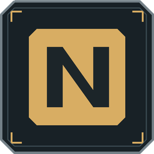

# NEXUS

Личная система для привычек, здоровья, финансов, работы и дневника. Приложения для Windows, Linux и Android сохраняют изменения автоматически и синхронизируются с собственным HTTPS-сервером.



## Возможности

- **Сегодня:** отметки привычек, вес и сон, задачи дня, текстовый и голосовой журнал.
- **Здоровье:** ежедневные и недельные привычки, календарь регулярности, динамика веса и самочувствие.
- **Финансы:** счета, расходы и доходы, переводы, бюджет, графики и отдельные инвестиционные портфели.
- **Работа:** вакансии, статусы, кейсы опыта, разбор текста вакансии и подготовка к интервью.
- **ИИ:** разбор дневника с проверкой предложений, распознавание речи, дневные и недельные сводки. Наставник использует строгий стиль и нецензурную лексику.
- **Пользователи:** отдельные базы и приглашения, персональные ключи OpenRouter с ограничением расходов.

## Установка

Готовые сборки размещаются в [Releases](https://github.com/CaptainReinor/nexus/releases). Windows: запустить установщик. Android: установить APK. Linux: разрешить выполнение файла AppImage и запустить его без установки. Версии: **Windows и Linux 0.4.7**, **Android 0.2.8**. [Запуск на Linux](docs/linux.md).

При первом запуске введите код доступа. Адрес сервера уже настроен; приглашение выдаёт владелец NEXUS. Доступ к чужим данным код не предоставляет. На новом аккаунте сразу есть счёт «Дебет» и девять категорий расходов.

Для собственной установки сервера измените `defaultServerEndpoint` в `NEXUS/src/shared/accounts.ts` перед сборкой приложений. Windows и Linux также могут работать без сервера, если закрыть окно входа.

Для обновления установить новую версию поверх прежней. Перед экспериментами с базой сделайте экспорт в настройках.

## Структура репозитория

```text
NEXUS/            Windows и Linux: Electron, React, SQLite и общие модули
NEXUS-Android/    Android: React, Capacitor, нативный AI-клиент
nexus_backup.py   HTTPS API синхронизации и копий
accounts.py       Изоляция серверных профилей и приглашения
install_vps.py    Установка службы с явными параметрами nginx
deploy/           Обновление серверного кода с откатом
docs/             Архитектура и установка сервера
```

Серверные файлы сохраняют прежние пути в корне: существующие ссылки на `raw.githubusercontent.com/.../main/nexus_backup.py` остаются действительными. Для обновления следует загружать **оба** модуля через подготовленный обновляющий скрипт.

## Разработка

Нужны Node.js 24; для Android дополнительно JDK 21 и Android SDK. Запускайте команды из соответствующей папки. Lock-файлы включены.

### Windows и Linux

```powershell
cd NEXUS
npm ci
npm ci --prefix ../NEXUS-Android --ignore-scripts
npm run typecheck
npm run lint
npm test
npm run dev
```

Для установщика: `npm run dist:win`. Нативный `better-sqlite3` должен соответствовать Electron; скрипт сборки использует бинарный модуль зависимости. На нестандартной системе может понадобиться сборка нативного модуля.

### Android

```powershell
cd NEXUS-Android
npm ci
npm ci --prefix ../NEXUS --ignore-scripts
npm run android:apk
```

Задайте `JAVA_HOME` и `ANDROID_HOME` либо настройте Android Studio. `android/local.properties` и ключи подписи не включаются в Git. Debug APK предназначен для тестирования; для распространения с постоянной подписью используйте собственный закрытый ключ. Его нельзя публиковать.

Общие компоненты и межплатформенные тесты используют зависимости соседнего приложения. Поэтому в командах выше устанавливаются оба набора; для соседней папки достаточно `--ignore-scripts`, без сборки её нативных модулей.

### Серверные тесты

```sh
python3 -m unittest -q test_nexus_backup test_accounts
```

[Установка и обновление сервера](docs/server.md) · [Архитектура](docs/architecture.md) · [Безопасность](SECURITY.md)

## Работа с обновлениями

Изменения проверяются в GitHub Actions. Публикация исходников не обновляет рабочий VPS: сервер обновляется отдельной командой по выбранному коммиту. Обновляющий скрипт сохраняет старый код, проверяет новую версию, перезапускает только службу NEXUS и возвращает старый код при неудачной проверке. Он не меняет nginx, базу и ключи.

## Лицензия

MIT. Лицензии сторонних зависимостей остаются за их авторами.
